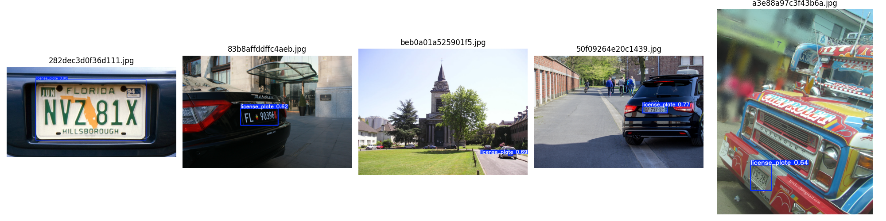
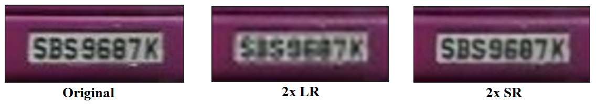
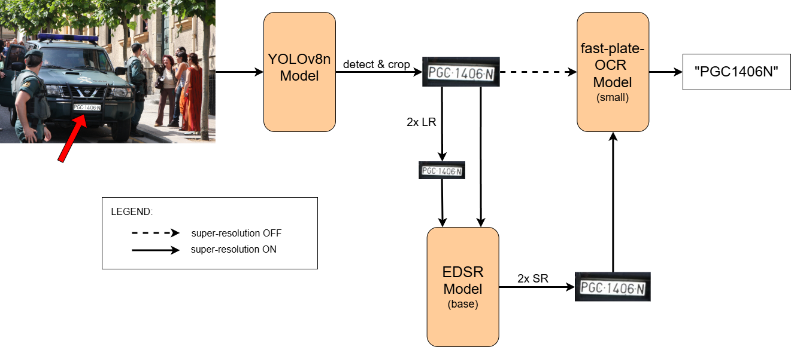

# COMP6341-Project
## Project Overview
This project incorporates three distinct models into a single cohesive pipeline that outputs the characters present in a license plate, given an input image of a vehicle with a plate visible. Our pipeline may also provide insight into the benefits of using super-resolution on low-resolution images for the task of character recognition, by toggling the super-resolution component.
First, the YOLOv8 model is used to automatically detect the bounding boxes of license plates given an input image of a vehicle with a plate visible. 

Then, the pipeline crops the input image to the detected bounding box of the license plate. 
The cropped images are then downsampled and passed to the EDSR model to perform super-resolution on a specified scale, matching that of the downsampling scale. 

These images are then passed to the fast-plate-OCR model for text recognition. The script will output the predicted characters of a license plate of a given image.

<br>

**Project pipeline and dataflow diagram:** 



## Requirements
pip install ultralytics \
pip install super-image \
pip install fast-plate-ocr \
pip install fast-plate-ocr[onnx-gpu] \
pip install opencv-python \
pip install matplotlib \
pip install tqdm \
pip3 install torch torchvision --index-url https://download.pytorch.org/whl/cu126 \
or (depending on CUDA version) \
pip3 install torch torchvision --index-url https://download.pytorch.org/whl/cu130 \
pip install python-Levenshtein

## How to Use
1. **Download the Dataset**:
   - Download the License Plate Detection dataset from [Kaggle](https://www.kaggle.com/datasets/fareselmenshawii/license-plate-dataset).
   - Extract the dataset and organize it as follows: \
     &emsp; **Note**: you may rename the extracted folder "archive" to "dataset", as we have
     ```
     dataset/
        images/
           train/
           val/
        labels/
           train/
           val/
     ```
   - Ensure the dataset/ folder is placed in the working directory of the project
2. **Create a .yaml file**:
   - Create a .yaml file in the following format to pass the dataset to the YOLOv8 model for fine-tuning:
     ```
     path: "path\\to\\dataset" # path should reach the parent folder "dataset" we extracted in the previous step

	   train: images/train
	   val: images/val

	   names:
  	    0: license_plate
     ```
   - Ensure the .yaml file is placed in the working directory of the project
3. **Fine-tune the YOLOv8 model**:
   - Run the training script with the necessary command line arguments \
     &emsp; List of command line arguments & their default values (how our experiments were set up): \
      	&emsp; &emsp; --model, type=str, default="yolov8n.pt" \
      	&emsp; &emsp; --data, type=str, required=True \
      	&emsp; &emsp; --epochs, type=int, default=100 \
      	&emsp; &emsp; --imgsz, type=int, default=960 \
      	&emsp; &emsp; --device, type=str, default="0" \
      	&emsp; &emsp; --workers, type=int, default=0 \
      	&emsp; &emsp; --name, type=str, default="license_plate_model"
     
    ```bash
	  python train_YOLOv8.py [command line args]
    ```
4. **Evaluate the model**:
   - Run the testing script with the necessary command line arguments \
     &emsp; List of command line arguments: \
      	&emsp; &emsp; --model_path, type=str, required=True \
      	&emsp; &emsp; --val_dir, type=str, required=True
     
   ```bash   
   python test_YOLOv8.py [command line args]
   ```
5. **Crop the images to their bounding box of license plates**:
   - Run the image cropping script with the necessary command line arguments \
     &emsp; List of command line arguments: \
      	&emsp; &emsp; --input_dir, type=str \
      	&emsp; &emsp; --output_dir, type=str \
      	&emsp; &emsp; --model_path, type=str
     
   ```bash
	 python image_cropping.py [command line args]
   ```
6. **Create low resolution versions of the cropped images**:
   - This script is NOT used to train the EDSR super-resolution model. The EDSR model performs on-the-fly downsampling to create (LR,      HR) pairs. 
   - This script is to be used on the VALIDATION cropped license plates, to test the qualitative performance of the EDSR super-	  resolution model after it is fine-tuned by comparing the upsampled LR versions with the HR ground truths. 
   - Run the downsampling script with the necessary command line arguments \
     &emsp; List of command line arguments & their default values (how our experiments were set up): \
      	&emsp; &emsp; -i OR --input_dir, type=str \
      	&emsp; &emsp; -o OR --output_dir, type=str \
      	&emsp; &emsp; -s OR --scale, type=float, default=2.0
     
   ```bash
   python create_lr.py [command line args]
   ```
7. **Fine-tune the EDSR model**:
   - The expect input is the high-resolution cropped license plate TRAIN dataset, NOT the low-resolution versions.
   - Again, the EDSR training pipeline automatically performs on-the-fly downsampling at the specified scale to create (LR, HR) pairs from a single HR input.
   - Run the training script with the necessary command line arguments \
     &emsp; List of command line arguments & their default values (how our experiments were set up): \
      	&emsp; &emsp; -i OR --input_dir, type=str \
      	&emsp; &emsp; -o OR --output_dir, type=str \
      	&emsp; &emsp; -lr OR --learning_rate, type=float, default=1e-4 \
     	&emsp; &emsp; --num_epochs, type=int, default=50 \
     	&emsp; &emsp; -s OR --scale, type=int, default=2 \
     	&emsp; &emsp; --patch_size, type=int

   ```bash
   python train_edsr.py [command line args]
   ```
8. **Perform super-resolution on the low resolution images**:
   - Expected input is the LR (downsampled) images.
   - Run the test script with the necessary command line arguments \
     &emsp; List of command line arguments & their default values (how our experiments were set up): \
      	&emsp; &emsp; -i OR --input_dir, type=str \
      	&emsp; &emsp; -o OR --output_dir, type=str \
     	&emsp; &emsp; -s OR --scale, type=int, default=2 \
     	&emsp; &emsp; --pretrained_model_path, type=str

   ```bash
   python test_edsr.py [command line args]
   ```
9. **Perform text recognition using the fast-plate-OCR model**:
   - Run the test script with the necessary command line arguments \
     &emsp; List of command line arguments & their default values (how our experiments were set up): \
      	&emsp; &emsp; -i OR --input_dir, type=str \
      	&emsp; &emsp; -o OR --output_dir, type=str \
     	&emsp; &emsp; -gt OR --ground_truth_file, type=str, default=None

   ```bash
   python fplateOCR_txtRec.py [command line args]
   ```
10. **Test a single image with a license plate present**:
   - Run the our end-to-end script to execute our complete project pipeline on an image that has a visible license plate present to output the characters of the license plate.
   - The file will detect and crop the license plate, perform optional super-resolution, and output the character sequence of the license plate
   - Run the end-to-end script with the necessary command line arguments \
     &emsp; List of command line arguments & their default values (how our experiments were set up): \
      	&emsp; &emsp; -i OR --input_dir, type=str \
     	&emsp; &emsp; --perform_SR, action="store_true" *i.e. False by default, True only when used*

   ```bash
   python end2end.py [command line args]
   ```
## File Descriptions:
***best.pt***: *(Found in the yolov8 directory)* This file containing our fine-tuned YOLOv8n model's best training weights. 

***licenseplatedataset.yaml***: This file is an example of how the dataset's .yaml file should be set up for fine-tuning the YOLOv8 model. 

***train_YOLOv8.py***: This file fine-tunes a YOLOv8 model using the License Plate Detection dataset. The default parameters used in our experiments were the YOLOv8n (the smallest and fastest variant) pretrained weights, 100 epochs, image size 960, GPU device, and 0 number of workers. The script saves the best model weights to the file path of "runs/detect/{args.name}/weights/best.pt". \
&emsp;*Note*: It took 6.2 hours to finish training on an NVIDIA 3060 12GB GPU. 

***test_YOLOv8.py***: This file evaluates the saved model on the inputed validation dataset. The script saves the metrics to the file path of "runs/detect/{args.name}/val". The script also outputs 5 randomly chosen samples of the dataset with the detected bounding boxes for qualitative analysis. 

***image_cropping.py***: This file uses the best saved YOLOv8 model to detect the bounding boxes of the dataset provided to the script and then crops the images to the bounding box area. The cropped license plate images get saved to the chosen output directory. 

***create_lr.py***: This file downsamples images to a specified scale. For the purpose of this project, we stuck to even number scale factors such as 2x and 4x. Odd number scaling (ex: 3x) may not work due to rounding issues causing size mismatches. The purpose of this script is to create low-resolution versions of the cropped validation dataset so that we can qualitatively assess the performance of the EDSR super-resolution model. The LR cropped license plates are also used to analyze the performance of the fast-plate-OCR model on different resolutions for the same image. 

***train_edsr.py***: This file fine-tunes the EDSR model using the high-resolution (HR) train cropped license plates dataset as input. The model performs on-the-fly downsampling at the specified scaling factor using the HR input to create (LR, HR) pairs for training. The default parameters used in our experiments were a learning rate of 1e-4, 50 epochs, and a scale of 2. The file saves the trained model weights, training loss curve, and a JSON file containing the history of training losses.

***test_edsr.py***: This file performs super-resolution to a specified scale. Ideally, the scale should match the scale used in create_lr.py (ex: if using 2x downsampled image, you should use a 2x scaling for super-resolution upsampling for optimal results). The file saves the upsampled image to a specified output directory. 

***fplateOCR_txtRec.py***: This file performs text recognition on the cropped license plate input images using the lightweight small fast-plate-OCR model. The script can optionally compute quantitative metrics (Levenshtein Distance) if provided the --ground_truth_file flag (see 'annotations.txt' for how to format the labels). If no ground truth file is provided, the script will simply read the characters from the cropped license plate and output it to a JSON file that is saved in the location where the file is being run by default (can optionally choose where the JSON file is saved using the '--output_dir' flag).

***end2end.py***:

***ocr_results_2xLR_val.json***: This file contains the predicted license plate characters for the 2x LR annotated validation dataset and the Levenshtein Distance quantitative metrics for each input as well as the average for the entire 107 annotated examples. 

***ocr_results_2xSR_val.json***: This file contains the predicted license plate characters for the 2x SR annotated validation dataset and the Levenshtein Distance quantitative metrics for each input as well as the average for the entire 107 annotated examples. 

***ocr_results_original_val.json***: This file contains the predicted license plate characters for the original high-resolution annotated validation dataset and the Levenshtein Distance quantitative metrics for each input as well as the average for the entire 107 annotated examples. 

***annotated_cropped_plates***: \
&emsp;>***manually_annotated_examples.zip***: This .zip contains 3 folders: "images", "images_2x_lr", and "images_2x_lr_2x_sr", and a .txt file "annotations.txt". \
&emsp;&emsp;>***images***: Contains 107 cropped license plate images sampled from the original dataset's validation set that we manually annotated. \
&emsp;&emsp;>***images_2x_lr***: Contains the 2x downsampled low-resolution versions of the 107 cropped license plate images. \
&emsp;&emsp;>***images_2x_lr_2x_sr***: Contains the 2x upsampled super-resolution versions of the 107 2x downsampled low-resolution cropped license plate images. \
&emsp;&emsp;>***annotations.txt***: This file contains the manually annotated labels of the 107 cropped license plate images' contents. The format of this file is:
```
   [image\file\path\image.jpg]{tab}[LicensePlateCharacters]
```

***edsr_2x_50epoch***: \
&emsp;>***2x_edsr_loss_history.json***: Saved training loss history of the EDSR model fine-tuning on a 2x scale. \
&emsp;>***2x_edsr_model_weights.pth***: Saved training weights of the EDSR model fine-tuning on a 2x scale. \
&emsp;>***2x_edsr_training_curve.png***: Saved training loss curve of the EDSR model fine-tuning on a 2x scale. 

***edsr_4x_50epoch***: \
&emsp;>***4x_edsr_loss_history.json***: Saved training loss history of the EDSR model fine-tuning on a 4x scale. \
&emsp;>***4x_edsr_model_weights.pth***: Saved training weights of the EDSR model fine-tuning on a 4x scale. \
&emsp;>***4x_edsr_training_curve.png***: Saved training loss curve of the EDSR model fine-tuning on a 4x scale.

[...]
